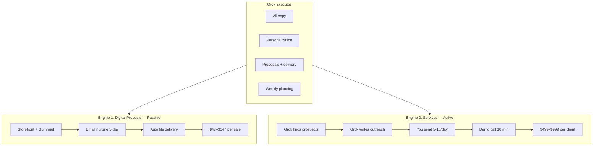

# Automated Sales & Marketing Plan — Michiana AI Solutions
**90% executable through Grok. You paste, click send, collect revenue.**

---

## Two Revenue Engines (Run Both)



| Engine | Monthly target | Your daily time | Grok's role |
|--------|----------------|-----------------|-------------|
| Digital kits | 10–30 sales ($470–$2,000) | 5 min (check Gumroad) | All content, sequences, storefront |
| Local services | 2–4 clients ($1,600–$3,200) | 20–30 min (send outreach) | Prospects, emails, proposals, delivery |

---

## Phase 1: Autopilot Infrastructure (Week 1 — One-Time)

**Grok command:** `/setup-storefront` then `/setup-gumroad` then `/setup-convertkit`

| Day | Task | Who | File |
|-----|------|-----|------|
| Mon | Deploy storefront to Vercel | Grok deploys, you connect GitHub | `AI_Business_Launch_Kit_Storefront.html` |
| Mon | Create 4 Gumroad products | You click, Grok writes descriptions | `grok_command_playbook.md` |
| Tue | Paste 5 emails into ConvertKit | You paste, Grok wrote them | `email_nurture_sequence.md` |
| Tue | Connect form to storefront CONFIG | You paste URL | storefront CONFIG block |
| Wed | Set up 2 Zapier zaps | You click, Grok documented steps | `automation_playbook.md` |
| Wed | Post Fiverr gig | You paste, Grok wrote it | `fiverr_gig_and_outreach_kit.md` |
| Thu | Join 5 FB groups | You click join | list in outreach kit |
| Thu | Schedule Week 1 social posts | Grok wrote them | `weekly_content_calendar.md` |
| Fri | Send first 10 outreach emails | Grok wrote, you send | `outreach_execution_pack.md` |

**End of Week 1:** Storefront live, emails automated, first outreach sent.

---

## Phase 2: Daily Autopilot Routine (15–35 min/day)

### Morning block (10 min) — Grok commands
```
/week-plan
```
or on any day:
```
/find-prospects [today's trade] Michiana
/batch-outreach [trade] 5
/social-today
```

**You:** Copy 5 emails into Gmail → send. Copy FB post → paste in one group.

### Midday (5 min) — Check alerts
- Gumroad sale? → Files auto-delivered. Grok command if buyer emails support: `/fiverr-response [message]`
- ConvertKit new subscriber? → Sequence runs automatically.
- Fiverr message? → `/fiverr-response [paste]`

### Evening (10 min, optional) — Follow-ups
```
/follow-up 2
/pipeline [paste who replied and who didn't]
```

**You:** Send 3 follow-ups. Book any demo calls.

---

## Phase 3: Weekly Rhythm

| Day | Grok generates | You execute |
|-----|----------------|-------------|
| **Monday** | `/week-plan` + `/batch-outreach` 10 emails | Send outreach, post Monday social |
| **Tuesday** | `/social-week` (if new week) + 5 prospect emails | Post, send |
| **Wednesday** | `/blog-post` or `/case-study` for email list | Paste to ConvertKit broadcast or FB |
| **Thursday** | `/follow-up` all non-responders from Mon | Send follow-ups |
| **Friday** | `/week-review` + `/pipeline` | Plan next week, send final follow-ups |
| **Weekend** | Off or `/deliver [client]` if closed | Deliver using kit templates |

---

## Sales Funnel — Services ($499–$999)

### Stage 1: Awareness (Automated content)
- FB group posts (weekly_content_calendar.md)
- Fiverr gig (inbound)
- Storefront chatbot (answers pricing questions)

### Stage 2: Outreach (Grok writes, you send)
- Cold email → demo link
- FB DM to businesses with bad sites
- Follow-up sequence (Day 3, 7, 14)

**Grok command per lead:**
```
/write-outreach [Business] [trade] [website URL]
```

### Stage 3: Demo (10 min — you talk, Grok prepped)
- Open `sample_plumber_website_demo.html`
- Show chat booking flow
- Quote Pro package ($799) as default

**Grok command before call:**
```
/prep-call [Business] [trade]
```

### Stage 4: Close
- Send proposal same day

**Grok command:**
```
/proposal [Business] [trade] Pro
```

### Stage 5: Deliver (Grok builds, you review)
```
/deliver-site [Business] [trade] [services]
/deliver-chatbot [Business] [trade]
/deliver-handoff
```

---

## Sales Funnel — Digital Products ($47–$147)

### Fully automated after setup:
1. Traffic → FB posts / Fiverr / word of mouth / SEO
2. Land → Storefront
3. Capture → Free checklist (ConvertKit)
4. Nurture → 5 emails (email_nurture_sequence.md)
5. Convert → Gumroad checkout
6. Deliver → Gumroad auto-download

**Your only job:** Occasional `/email-blast` when Grok writes a promo.

---

## 30-Day Revenue Targets

| Week | Service goal | Digital goal | Combined |
|------|--------------|--------------|----------|
| 1 | 2 discovery calls | Storefront + sequence live | Setup |
| 2 | 1 client ($599 pilot) | 3 kit sales ($141–$291) | $740–$890 |
| 3 | 1 client ($799) | 5 kit sales | $1,034–$1,284 |
| 4 | 2 clients ($1,200) | 8 kit sales | $1,576–$2,176 |

**Grok command to track:**
```
/week-review
[paste Gumroad sales + outreach replies + calls booked]
```

---

## Target Niches (Rotate Weekly)

| Week | Primary trade | Why |
|------|---------------|-----|
| 1 | Plumbers | Demo is plumber-themed |
| 2 | HVAC | Same booking pain, winter/summer urgency |
| 3 | Dentists | Higher ticket, appointment booking |
| 4 | Electricians / contractors | Michiana construction activity |

**Grok command:**
```
/find-prospects [trade] South Bend Granger Mishawaka
```

---

## Objection → Grok Response Map

| They say | Grok command |
|----------|--------------|
| "Too expensive" | `/post-call said too expensive` |
| "Already have a website" | `/follow-up` (chatbot-only angle) |
| "Need to think" | `/post-call want to think` |
| "Send more info" | `/proposal [name] Starter` (lighter $499) |
| Fiverr buyer haggling | `/fiverr-response [message]` |

---

## Files in Your Kit (Reference)

| File | Purpose |
|------|---------|
| `grok_command_playbook.md` | **Start here daily** — all Grok commands |
| `email_nurture_sequence.md` | Paste into ConvertKit |
| `weekly_content_calendar.md` | 4 weeks of posts (pre-written) |
| `outreach_execution_pack.md` | Templates + tracking sheet |
| `lead_magnet_checklist.md` | Free checklist for email gate |
| `automation_playbook.md` | Gumroad/Zapier tech setup |
| `AI_Business_Launch_Kit_Storefront.html` | Sales page |

---

## Start Right Now (3 Grok Commands)

Paste these into Grok in order:

**1. This week's plan:**
```
/week-plan
Today is June 25, 2026. Create my Michiana AI Solutions sales and marketing plan for this week. Include daily outreach targets (plumbers in Michiana), which social posts to use from weekly_content_calendar.md, and revenue goal $1,000.
```

**2. First outreach batch:**
```
/batch-outreach plumbers 10
Write 10 personalized cold emails for plumbers in South Bend, Granger, and Mishawaka. Reference outdated websites. Include demo link placeholder https://YOUR-STORE.vercel.app/sample_plumber_website_demo.html. Sign Cameron, 574.274.0643.
```

**3. Today's post:**
```
/social-today
Write today's FB post for Michiana small business owners. Promote free AI launch checklist. Soft CTA.
```

Then open `grok_command_playbook.md` every morning.

---

*Michiana AI Solutions — Sales & marketing run by Grok, revenue collected by you.*